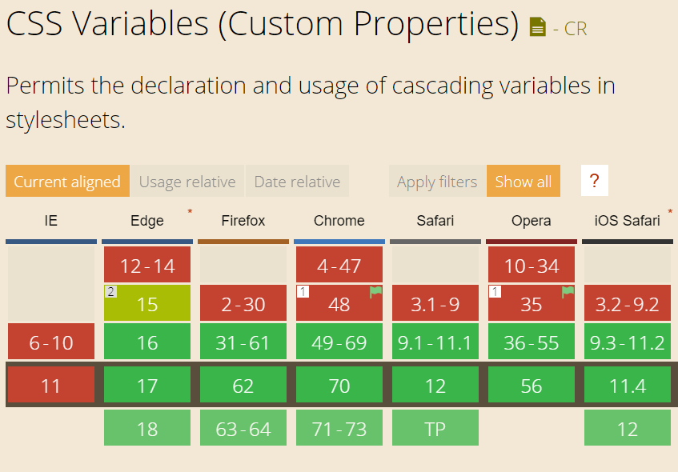

# CSS-Variablen

...denn wer weiss schon, was #3b5998 bedeutet

---

### Das Problem

<iframe height='400' scrolling='no' title='sae__presentation-css-variables--01' src='//codepen.io/simon-jaeger/embed/LXdzJB/?height=400&theme-id=dark&default-tab=css,result' frameborder='no' allowtransparency='true' allowfullscreen='true' style='width: 100%;'>See the Pen <a href='https://codepen.io/simon-jaeger/pen/LXdzJB/'>sae__presentation-css-variables--01</a> by Simon Jäger (<a href='https://codepen.io/simon-jaeger'>@simon-jaeger</a>) on <a href='https://codepen.io'>CodePen</a>.
</iframe>
---

### Die Lösung

<iframe height='400' scrolling='no' title='sae__presentation-css-variables--02' src='//codepen.io/simon-jaeger/embed/aQYLrG/?height=400&theme-id=dark&default-tab=css,result' frameborder='no' allowtransparency='true' allowfullscreen='true' style='width: 100%;'>See the Pen <a href='https://codepen.io/simon-jaeger/pen/aQYLrG/'>sae__presentation-css-variables--02</a> by Simon Jäger (<a href='https://codepen.io/simon-jaeger'>@simon-jaeger</a>) on <a href='https://codepen.io'>CodePen</a>.
</iframe>

---

### Syntax

```css
:root {
  /*--var-name: value;*/
  --bg-color: #333;
}

.element {
  /*property: var(--var-name);*/
  background-color: var(--bg-color);
}
```

---

### Vorteile

- Einfach anzupassen
- Aussagekräftiger (#3b5998 vs --brand-color)
- ...

---

### Browserkompatibilität



---

CSS-Variablen, Simon Jäger<br>
github.com/simon-jaeger

<br>
<br>

Quellen

- https://developer.mozilla.org/en-US/docs/Web/CSS/Using_CSS_variables
- https://caniuse.com/#feat=css-variables
